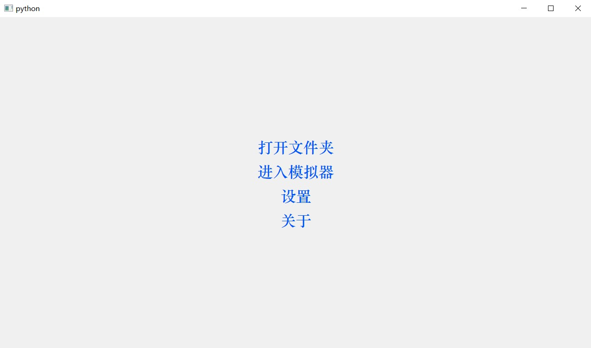
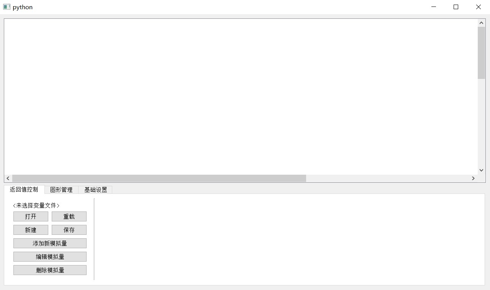
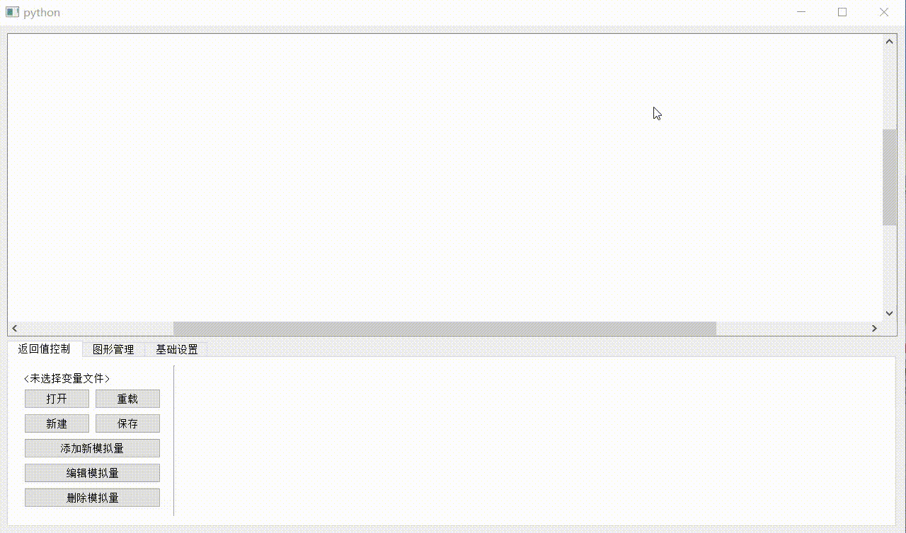
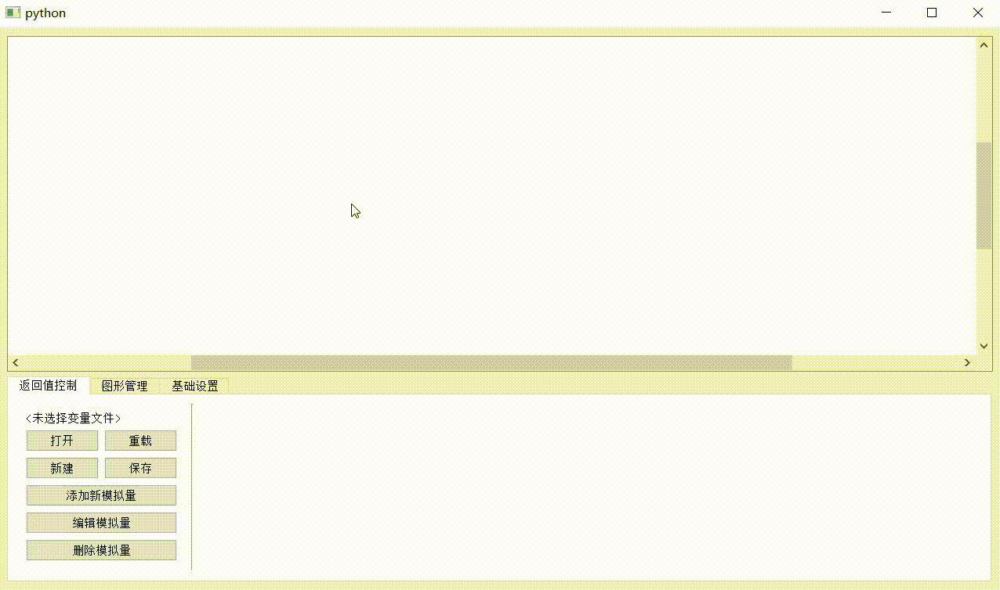

# README

本程序实现了RoboMaster比赛中机器人与客户端UI绘制模拟。当前只能在Win端构建和编译。

此项目的目的是实现在电脑上拖拽构建界面并自动生成代码与大部分逻辑，最终生成可以在多平台（包括机器人端）运行的代码（最好是c语言代码）。

当前进度：Win端模拟器，尚无拖拽实现功能。

## 安装：

*方式一：git下载*

```bash
git https://github.com/ohitworks/RM_UI_Simulator
cd RM_UI_Simulator
# 用此命令启动
python -m RM_UI_Simulator
# 通过此命令安装模块
python setup.py install
# 然后就可以删除刚才克隆的代码了
```

*方式二：pip安装*

1. 从 https://github.com/ohitworks/RM_UI_Simulator/releases/ 选择并下载发行版的whl文件
2. 命令行执行`pip install {刚才的文件}`

## 使用方式

### 基本功能

> 本小节截图来自不同版本, 更新后界面有一定变化

#### 1. 启动

执行`python -m RM_UI_Simulator`打开页面，此时会进入欢迎界面或模拟器界面。

下图是欢迎界面：



下图是模拟器界面：



在模拟器界面中，“设置”按钮被隐藏在左上角，可用当鼠标滑动到附近时会显示。



由于系统缩放不同，显示按键大小可能不同，这是正常现象。

#### 2. 服务器调整

在模拟器界面中，点击“服务器未启动”标签可用修改服务器状态和监听端口，当服务器监听端口时，使用套接字可用与服务器进行通信。



开启服务器后，生成和编译并执行绘图代码即可以看到效果。

#### 3. 生成项目

示例`demo/sample-ui-project`目录如下：

```
sample-ui-project
 ┝- Widgets
 |   ┝ circle_and_line.c
 |   ┕ circle_and_line.h
 ┕- Core
     ┝ data_tool.c
     ┝ data_tool.h
     ┝ main.c
     ┕ main.h
```

进入模拟器，从欢迎界面中点击“打开文件夹”，并选择示例目录。

**TODO**: 回来接着写

## 项目架构

关键路径和文件介绍

```
┍- .git/
┝- ReadmeSource/               : source for REAMME.md
┝- RM_UI_Simulator/            : the files for python moudle
|  ┝- C_platform/              : 包括C语言交互层和CMakeLists.txt构建器
|  |  ┝- Builder/              : CMakeLists.txt构建器所在目录
|  |  ┕- win32/                : 在windows系统上使用的C语言交互层
|  ┝- c_reader/                : C语言解释器（未完成）
|  ┝- qtui/                    : UI 和主要逻辑程序所在位置
|  |  ┝- main_window/          : UI主界面
|  |  ┝- option_ui/            : UI设置按钮
|  |  ┕- player_ui/            : UI模拟器界面
|  ┝- tools/                   : 一些帮助UI绘制的小工具
|  ┝- data.py                  : 数据管理程序
|  ┕- values                   : 保存了如版本号等数据
┕- test/                       : files for test this project
```

**这里打个备份**

1. 首先需要将项目原本的交互层更改为此模拟器的交互层，即`RM_UI_Simulator/C_platform/${os.platform}`文件夹中的`platform.h`和`platform.c`。
2. win中需要动态链接库`-lwsock32`。如果提示没有这个库，看看有没有安装`winsock2`。
3. 在执行模拟前，需要以服务器模式启动模拟器，命令为`python -m RM_UI_Simulator server`。该模式下，模拟器会监听5510端口消息。
4. 别忘了安装 CMake 和 Ninja。

### 调用

在C语言端，调用任意函数前，需执行`platform_init()`。在不使用该交互模块后，可调用`platform_finish()`。

**备份结束**

## P.S.

- 目前`layout`参量无效。
- 大量功能未完成。
- 现在想想UI和无UI功能应该分离在不同模块中，至少在不同文件中。回来再改吧，先统计有哪些功能。

## 已知问题

1. 在`write_a_char`等方法中带有括号、逗号的字符提交可能导致“注入式攻击”以致闪退。 -> 优化正则表达式
2. 在不同大小屏幕间移动时会有字体显示不全问题。
3. msys2安装的`cmake`包无法自动构建，但是`mingw-w64-cmake`可以。 (好像这不是我的问题，是msys2的啊)

## 计划更新

- <del>取消 Ninja 依赖</del>*(完成)*
  - 自主选择工具链
- 应当做好功能和UI分离，即不启动UI也可实现功能，目前二者耦合度过高，可以先剥离QMessageBox部分
- 优化消息，至少不要都是弹窗

## 更新记录
- Version 1.0.0 (2022-3-26)   
  基础功能
  
- Version 1.0.1 (2022-3-26)  
  修复了 not_graphic_name 的bug
  
- Version 1.0.2 (2022-3-29)

  实现了变量文件功能，取消了界面大小锁定，添加白板大小调整功能

- Version 1.1.0 (2022-4-2)
  
  添加了`draw_a_rectangular`功能。版本号突跃是为了补上上一次提交。
  
- Version 1.1.1 (2022-4-15)
  现在程序自适应高分辨率情况。
  
- Version 2,0,0 (2022-4-29)

  丰富了UI，添加了CMake构建功能。
  
- Version 2.2.1 (2022-4-29)

  修复了若干小bug，添加了“跨平台”功能
  
- Version 2.2.2 (2022-5-1)

  添加了C与CXX编译器路径设置功能，修改默认端口为5510
  
- Version 2.2.4 (2022-5-14)

  优化了生成的CMakeLists.txt文本。
  
- Version 2.2.5 (2022-5-27)

  1. 修改了更改项目目录则无法删除已移动的文件的bug
  2. 现在可拖拽修改模拟器界面中的显示、管理界面大小
  3. 添加了variables文件，用于保存版本号等信息
  4. 现将 platform.h 中端口配置为更新后的默认端口
  
- Version 2.2.6 (2022-5-28)

  1. 修复了CMake路径带有空格则无法运行的bug
  2. 修复了加载变量文件后保存、重载需要再次选择文件的bug
  3. 将platform.h中PART的类型修改回了define，以修复无法编译的问题
  4. 发现重新选择项目文件时项目路径不存在自动删除原项目路径
  5. 更新了项目选择页面的消息显示策略
  
- Version 2.2.7-alpha (2022-7-9)

  1. 规范化了版本号设置
  2. 更新了文档
  3. 修改了部分文字提示
  
- Version 2.2.8-alpha (2022-7-16)

  1. 现在可用在模拟器界面修改端口了
  2. 更新了文档
  
- Version 2.2.9-alpha (2022-8-4)

  1. 修复了多次打开项目编辑会崩溃的bug
  2. 移除了ninja依赖
  3. 添加了构建消息提示

- Version 2.2.10-alpha (2022-8-7)

  1. 使用工作区配置保存上次加载的变量文件位置, 在切换工作路径后回自动变换位置
  2. 完成了一个示例
  3. 更新了文档

- Version 3.0.0-alpha (2022-8-9)

  1. 现在工作区配置文件保存相对路径
  2. 工作区配置文件添加了版本
